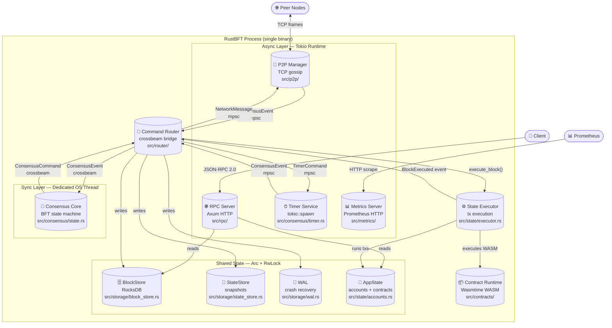

# C4 Level 2: Container Diagram

Shows the major deployable/runnable units inside a single RustBFT node process.

## Container Responsibilities

| Container | Thread | Responsibility |
|-----------|--------|----------------|
| **RPC Server** | Tokio | JSON-RPC 2.0 HTTP — query & submit |
| **P2P Manager** | Tokio | TCP accept, handshake, encrypted gossip |
| **Timer Service** | Tokio | Schedule/cancel timeouts per (height, round) |
| **Metrics Server** | Tokio | Expose Prometheus metrics endpoint |
| **Command Router** | Tokio | Bridge: sync consensus ↔ async subsystems |
| **Consensus Core** | OS thread | BFT state machine — pure, no I/O |
| **State Executor** | Tokio (via Router) | Execute transactions, compute state_root |
| **Contract Runtime** | Tokio (via Executor) | Wasmtime WASM sandbox execution |
| **BlockStore** | Shared (Arc) | RocksDB: blocks, hashes, validator sets |
| **StateStore** | Shared (Arc) | AppState snapshots per height |
| **WAL** | Shared (Arc) | Append-only crash-recovery log |
| **AppState** | Shared (Arc+RwLock) | Live account balances, contract storage |
