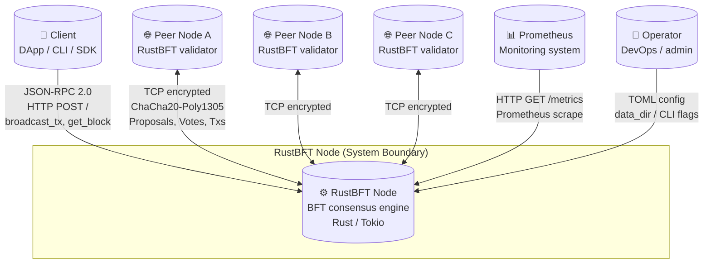

# C4 Level 1: System Context

Shows external actors and systems that interact with a RustBFT node.

## External Actors

| Actor | Role | Protocol |
|-------|------|----------|
| **Client** | Submits transactions, queries state | JSON-RPC 2.0 over HTTP |
| **Peer Node** | Fellow BFT validator, gossips proposals/votes | TCP with ChaCha20-Poly1305 encryption |
| **Prometheus** | Scrapes metrics for observability | HTTP `/metrics` endpoint |
| **Operator** | Configures and deploys node | TOML config file, CLI |
