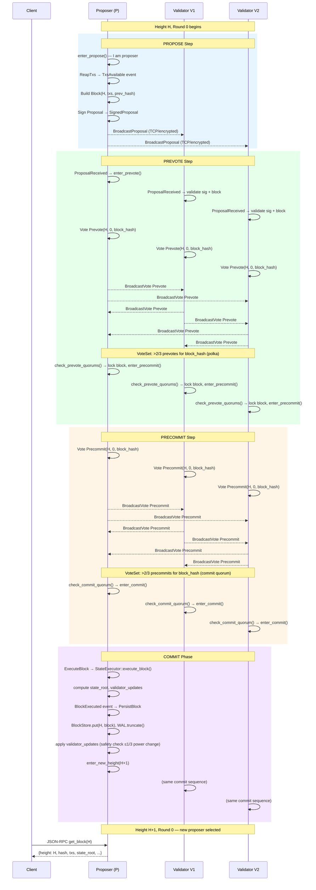
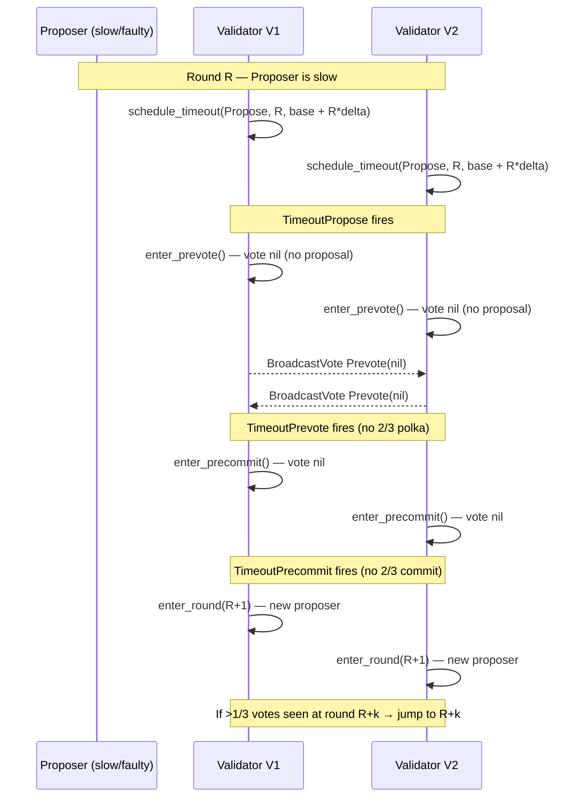

# BFT Consensus — Happy Path Sequence

Single height (H), round 0. Proposer node P and two validator nodes V1, V2 (n=3f+1, f=1).

```mermaid
sequenceDiagram
    participant C as Client
    participant P as Proposer (P)
    participant V1 as Validator V1
    participant V2 as Validator V2

    Note over P,V2: Height H, Round 0 begins

    %% ─── PROPOSE ───────────────────────────────────────────────
    rect rgb(230, 245, 255)
        Note over P,V2: PROPOSE Step
        P->>P: enter_propose() — I am proposer
        P->>P: ReapTxs → TxsAvailable event
        P->>P: Build Block(H, txs, prev_hash)
        P->>P: Sign Proposal → SignedProposal
        P-->>V1: BroadcastProposal (TCP/encrypted)
        P-->>V2: BroadcastProposal (TCP/encrypted)
    end

    %% ─── PREVOTE ────────────────────────────────────────────────
    rect rgb(230, 255, 235)
        Note over P,V2: PREVOTE Step
        P->>P: ProposalReceived → enter_prevote()
        V1->>V1: ProposalReceived → validate sig + block
        V2->>V2: ProposalReceived → validate sig + block

        P->>P: Vote Prevote(H, 0, block_hash)
        V1->>V1: Vote Prevote(H, 0, block_hash)
        V2->>V2: Vote Prevote(H, 0, block_hash)

        P-->>V1: BroadcastVote Prevote
        P-->>V2: BroadcastVote Prevote
        V1-->>P: BroadcastVote Prevote
        V1-->>V2: BroadcastVote Prevote
        V2-->>P: BroadcastVote Prevote
        V2-->>V1: BroadcastVote Prevote

        Note over P,V2: VoteSet: >2/3 prevotes for block_hash (polka)
        P->>P: check_prevote_quorums() → lock block, enter_precommit()
        V1->>V1: check_prevote_quorums() → lock block, enter_precommit()
        V2->>V2: check_prevote_quorums() → lock block, enter_precommit()
    end

    %% ─── PRECOMMIT ──────────────────────────────────────────────
    rect rgb(255, 245, 230)
        Note over P,V2: PRECOMMIT Step
        P->>P: Vote Precommit(H, 0, block_hash)
        V1->>V1: Vote Precommit(H, 0, block_hash)
        V2->>V2: Vote Precommit(H, 0, block_hash)

        P-->>V1: BroadcastVote Precommit
        P-->>V2: BroadcastVote Precommit
        V1-->>P: BroadcastVote Precommit
        V1-->>V2: BroadcastVote Precommit
        V2-->>P: BroadcastVote Precommit
        V2-->>V1: BroadcastVote Precommit

        Note over P,V2: VoteSet: >2/3 precommits for block_hash (commit quorum)
        P->>P: check_commit_quorum() → enter_commit()
        V1->>V1: check_commit_quorum() → enter_commit()
        V2->>V2: check_commit_quorum() → enter_commit()
    end

    %% ─── COMMIT ─────────────────────────────────────────────────
    rect rgb(245, 230, 255)
        Note over P,V2: COMMIT Phase
        P->>P: ExecuteBlock → StateExecutor::execute_block()
        P->>P: compute state_root, validator_updates
        P->>P: BlockExecuted event → PersistBlock
        P->>P: BlockStore.put(H, block), WAL.truncate()
        P->>P: apply validator_updates (safety check ≤1/3 power change)
        P->>P: enter_new_height(H+1)

        V1->>V1: (same commit sequence)
        V2->>V2: (same commit sequence)
    end

    Note over P,V2: Height H+1, Round 0 — new proposer selected

    %% ─── CLIENT QUERY ───────────────────────────────────────────
    C->>P: JSON-RPC get_block(H)
    P-->>C: {height: H, hash, txs, state_root, ...}
```

## Timeout / Round-Skip Paths

```mermaid
sequenceDiagram
    participant P as Proposer (slow/faulty)
    participant V1 as Validator V1
    participant V2 as Validator V2

    Note over P,V2: Round R — Proposer is slow

    V1->>V1: schedule_timeout(Propose, R, base + R*delta)
    V2->>V2: schedule_timeout(Propose, R, base + R*delta)

    Note over V1,V2: TimeoutPropose fires
    V1->>V1: enter_prevote() — vote nil (no proposal)
    V2->>V2: enter_prevote() — vote nil (no proposal)

    V1-->>V2: BroadcastVote Prevote(nil)
    V2-->>V1: BroadcastVote Prevote(nil)

    Note over V1,V2: TimeoutPrevote fires (no 2/3 polka)
    V1->>V1: enter_precommit() — vote nil
    V2->>V2: enter_precommit() — vote nil

    Note over V1,V2: TimeoutPrecommit fires (no 2/3 commit)
    V1->>V1: enter_round(R+1) — new proposer
    V2->>V2: enter_round(R+1) — new proposer

    Note over V1,V2: If >1/3 votes seen at round R+k → jump to R+k
```
