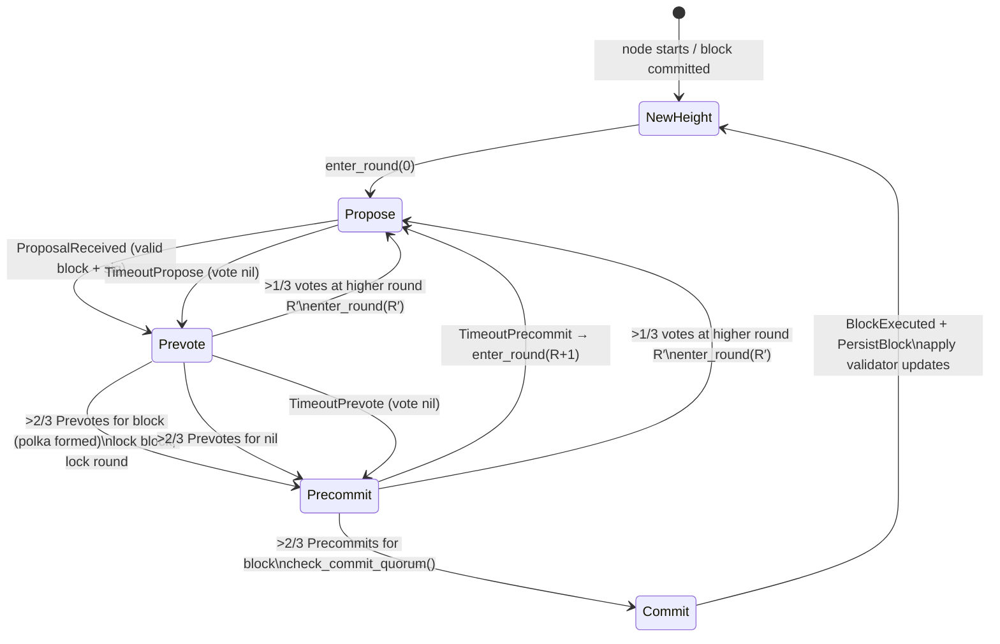
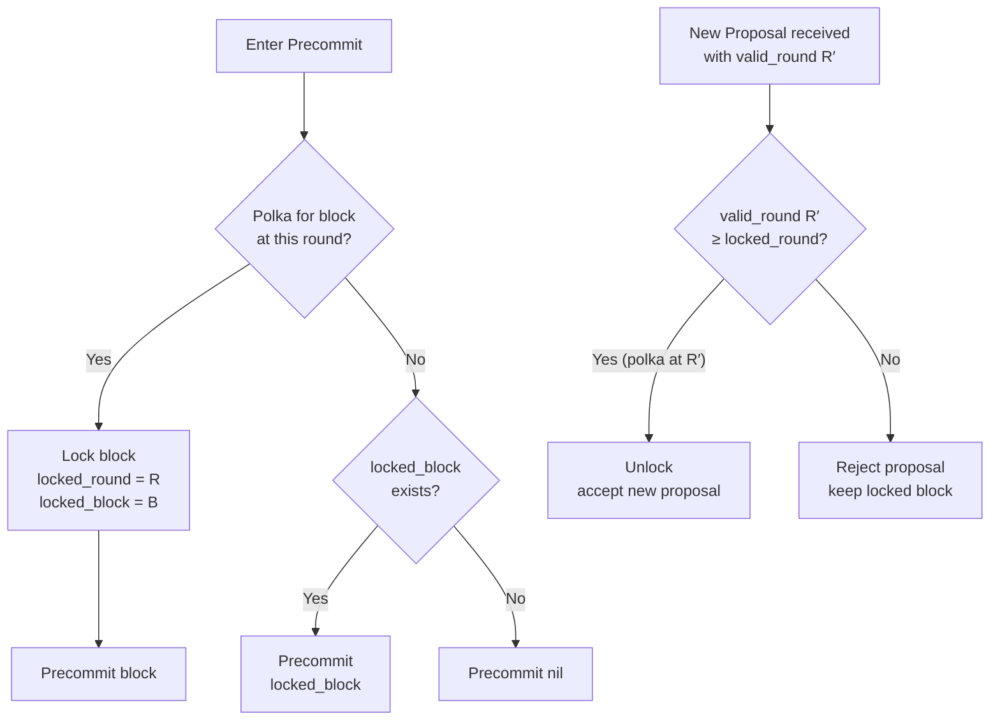

# Consensus State Machine

State transitions for a single validator in the BFT protocol.
Source: `src/consensus/state.rs` — `Step` enum and `enter_*()` methods.



## Step Descriptions

| Step | Entry Condition | Actions |
|------|----------------|---------|
| **NewHeight** | Block committed at H | Reset state, apply validator_updates, schedule new height |
| **Propose** | Entering round R | If proposer: build/re-propose block. Schedule TimeoutPropose |
| **Prevote** | Proposal received or TimeoutPropose | Vote `block_hash` (if valid) or `nil`. Schedule TimeoutPrevote |
| **Precommit** | Polka formed or TimeoutPrevote | Vote `block_hash` (if locked) or `nil`. Schedule TimeoutPrecommit |
| **Commit** | >2/3 Precommits for block | Execute block → persist → advance height |

## Locking Rules (Safety Invariants)



## Timeout Backoff

Each step's timeout grows linearly with the round number:

```
timeout(step, round) = base_timeout_<step>_ms + round × timeout_delta_ms
```

| Step | Default base | Default delta |
|------|-------------|--------------|
| Propose | configurable | configurable |
| Prevote | configurable | configurable |
| Precommit | configurable | configurable |

Source: `ConsensusConfig` in `src/consensus/mod.rs`
