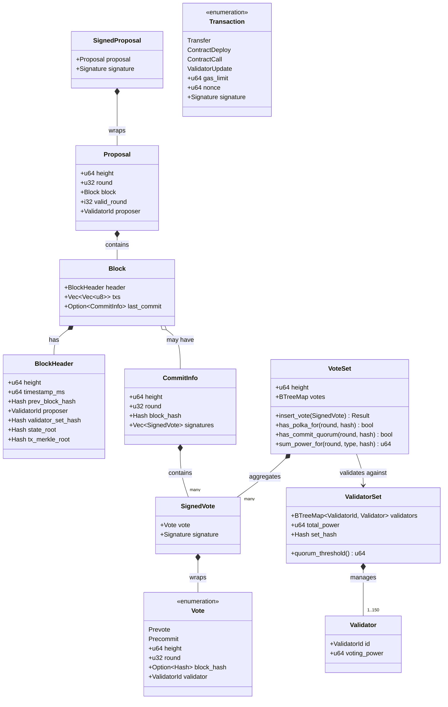
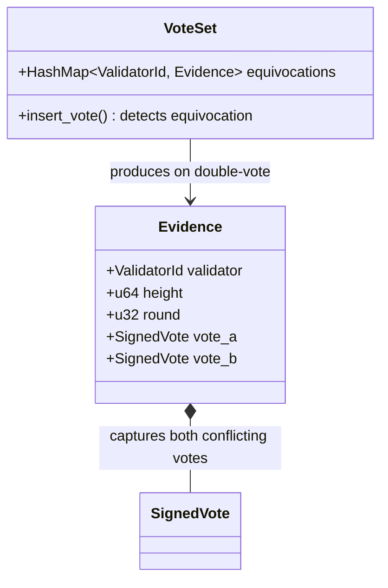

# Core Domain Types

Class diagram of the key types in `src/types/` and their relationships.

```mermaid
classDiagram
    class Block {
        +BlockHeader header
        +Vec~Vec~u8~~ txs
        +Option~CommitInfo~ last_commit
    }

    class BlockHeader {
        +u64 height
        +u64 timestamp_ms
        +Hash prev_block_hash
        +ValidatorId proposer
        +Hash validator_set_hash
        +Hash state_root
        +Hash tx_merkle_root
    }

    class CommitInfo {
        +u64 height
        +u32 round
        +Hash block_hash
        +Vec~SignedVote~ signatures
    }

    class SignedProposal {
        +Proposal proposal
        +Signature signature
    }

    class Proposal {
        +u64 height
        +u32 round
        +Block block
        +i32 valid_round
        +ValidatorId proposer
    }

    class SignedVote {
        +Vote vote
        +Signature signature
    }

    class Vote {
        <<enumeration>>
        Prevote
        Precommit
        +u64 height
        +u32 round
        +Option~Hash~ block_hash
        +ValidatorId validator
    }

    class ValidatorSet {
        +BTreeMap~ValidatorId, Validator~ validators
        +u64 total_power
        +Hash set_hash
        +quorum_threshold() u64
    }

    class Validator {
        +ValidatorId id
        +u64 voting_power
    }

    class Transaction {
        <<enumeration>>
        Transfer
        ContractDeploy
        ContractCall
        ValidatorUpdate
        +u64 gas_limit
        +u64 nonce
        +Signature signature
    }

    class VoteSet {
        +u64 height
        +BTreeMap votes
        +insert_vote(SignedVote) Result
        +has_polka_for(round, hash) bool
        +has_commit_quorum(round, hash) bool
        +sum_power_for(round, type, hash) u64
    }

    Block *-- BlockHeader : has
    Block o-- CommitInfo : may have
    CommitInfo *-- "many" SignedVote : contains
    SignedProposal *-- Proposal : wraps
    Proposal *-- Block : contains
    SignedVote *-- Vote : wraps
    ValidatorSet *-- "1..150" Validator : manages
    VoteSet --> ValidatorSet : validates against
    VoteSet *-- "many" SignedVote : aggregates
```

## Evidence & Equivocation

```mermaid
classDiagram
    class Evidence {
        +ValidatorId validator
        +u64 height
        +u32 round
        +SignedVote vote_a
        +SignedVote vote_b
    }

    class VoteSet {
        +HashMap~ValidatorId, Evidence~ equivocations
        +insert_vote() detects equivocation
    }

    VoteSet --> Evidence : produces on double-vote
    Evidence *-- SignedVote : captures both conflicting votes
```
