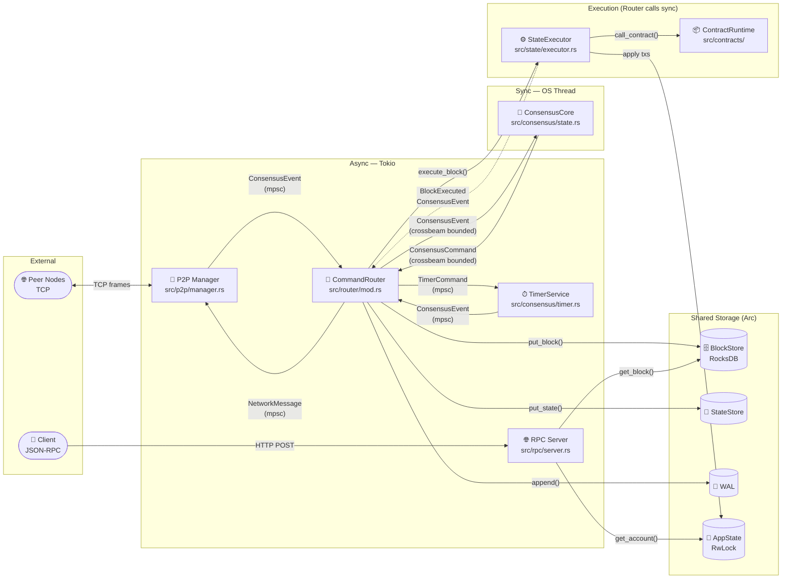

# Data Flow & Channel Topology

Shows how data moves through the RustBFT process: channels, shared state reads/writes.

## Channel Summary

| Channel | Type | From | To | Capacity |
|---------|------|------|----|---------|
| `P2P → Router` | `mpsc` | P2P Manager | Command Router | bounded |
| `Timer → Router` | `mpsc` | TimerService | Command Router | bounded |
| `Router → Core` | `crossbeam` | Command Router | ConsensusCore | bounded |
| `Core → Router` | `crossbeam` | ConsensusCore | Command Router | bounded |
| `Router → P2P` | `mpsc` | Command Router | P2P Manager | bounded |
| `Router → Timer` | `mpsc` | Command Router | TimerService | bounded |
| `Router → Core` (BlockExecuted) | `crossbeam` | Command Router (post-execute) | ConsensusCore | bounded |

## Shared State Access Patterns

| Component | BlockStore | AppState | StateStore | WAL |
|-----------|-----------|---------|------------|-----|
| RPC Server | read | read | — | — |
| Command Router | write | — | write | write |
| State Executor | — | write | — | — |
| P2P Manager | — | — | — | — |
| ConsensusCore | — | — | — | — |
