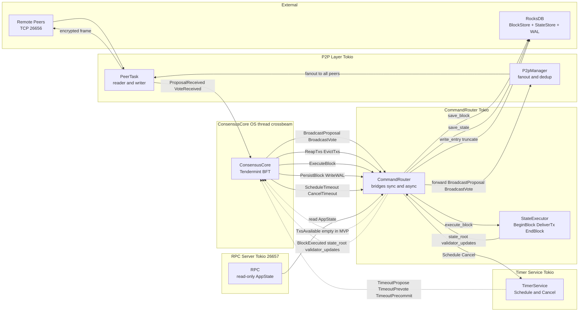
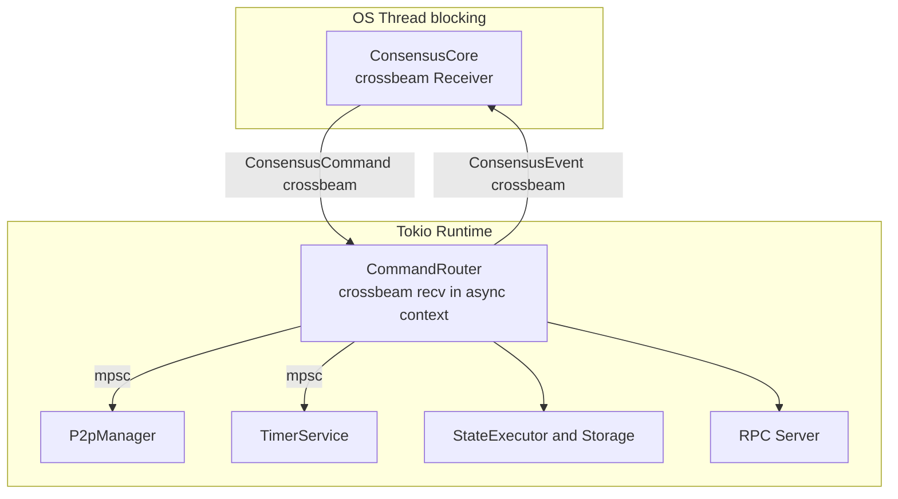

# Consensus Event Flow

Source: `src/consensus/events.rs`, `src/router/mod.rs`, `src/p2p/manager.rs`, `src/consensus/timer.rs`

## Command / Event Bus Overview

## Event Classification

### ConsensusEvent (inbound to ConsensusCore)

| Event | Source | Trigger |
|---|---|---|
| `ProposalReceived` | P2P reader task | Remote peer sent proposal, after sig verify |
| `VoteReceived` | P2P reader task | Remote peer sent prevote or precommit |
| `TimeoutPropose` | TimerService | Propose timer expired for height, round |
| `TimeoutPrevote` | TimerService | Prevote timer expired |
| `TimeoutPrecommit` | TimerService | Precommit timer expired |
| `TxsAvailable` | CommandRouter | Response to ReapTxs, empty in MVP |
| `BlockExecuted` | CommandRouter | StateExecutor finished execute_block |

### ConsensusCommand (outbound from ConsensusCore)

| Command | Destination | Purpose |
|---|---|---|
| `BroadcastProposal` | P2P Manager | Proposer publishing block proposal |
| `BroadcastVote` | P2P Manager | Node broadcasting prevote or precommit |
| `ReapTxs` | CommandRouter mempool | Proposer requesting transactions |
| `EvictTxs` | CommandRouter mempool | Post-commit eviction, placeholder |
| `ExecuteBlock` | CommandRouter StateExecutor | Trigger deterministic block execution |
| `PersistBlock` | CommandRouter RocksDB | Persist committed block and state |
| `WriteWAL` | CommandRouter WAL | Crash-recovery journal entry |
| `ScheduleTimeout` | TimerService | Arm a one-shot timeout |
| `CancelTimeout` | TimerService | Disarm timeout after commit |

## Async Boundary

`ConsensusCore` runs on a dedicated OS thread using blocking crossbeam recv. Everything else is Tokio async. `CommandRouter` bridges the boundary — this is intentional to avoid async overhead in the hot BFT path.

> **Verified against:** `src/consensus/events.rs` — all enum variants; `src/router/mod.rs` — full match on `ConsensusCommand`; `src/p2p/manager.rs` — fanout logic; `src/main.rs` — thread/task topology.
