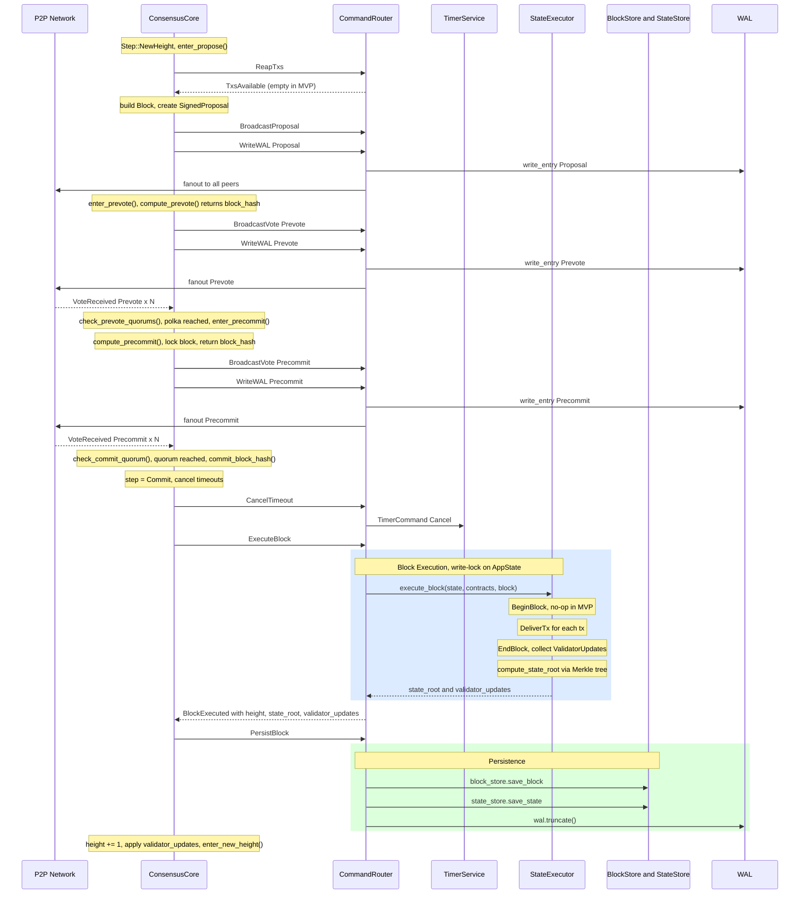
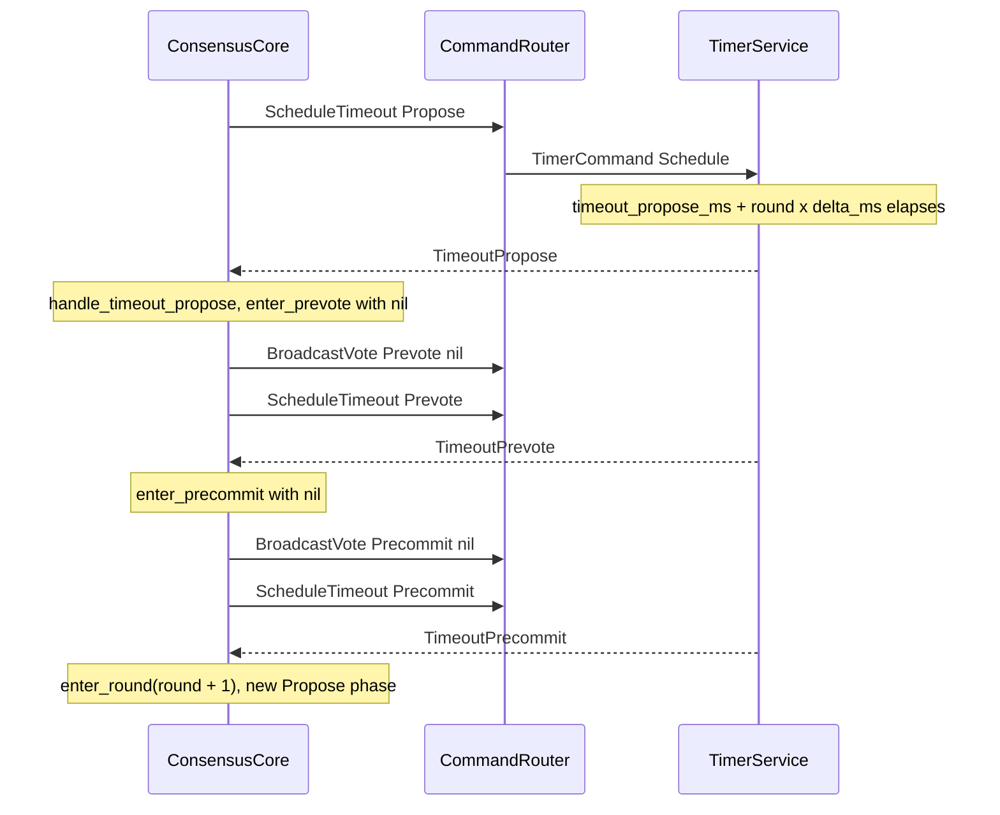

# Block Commit Sequence (Happy Path)

Source: `src/consensus/state.rs`, `src/router/mod.rs`, `src/state/executor.rs`, `src/storage/block_store.rs`

## Proposer Path — Single Round

## Timeout Path (No Proposal or No Quorum)

> **Verified against:** `src/consensus/state.rs` — full `run()` loop; `src/router/mod.rs` — `ExecuteBlock`, `PersistBlock`, `WriteWAL` arms; `src/state/executor.rs` — `execute_block()`.
