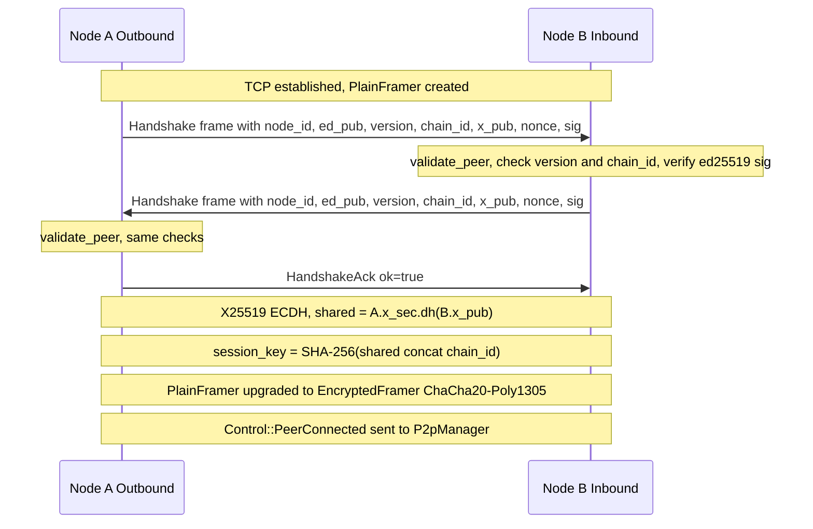
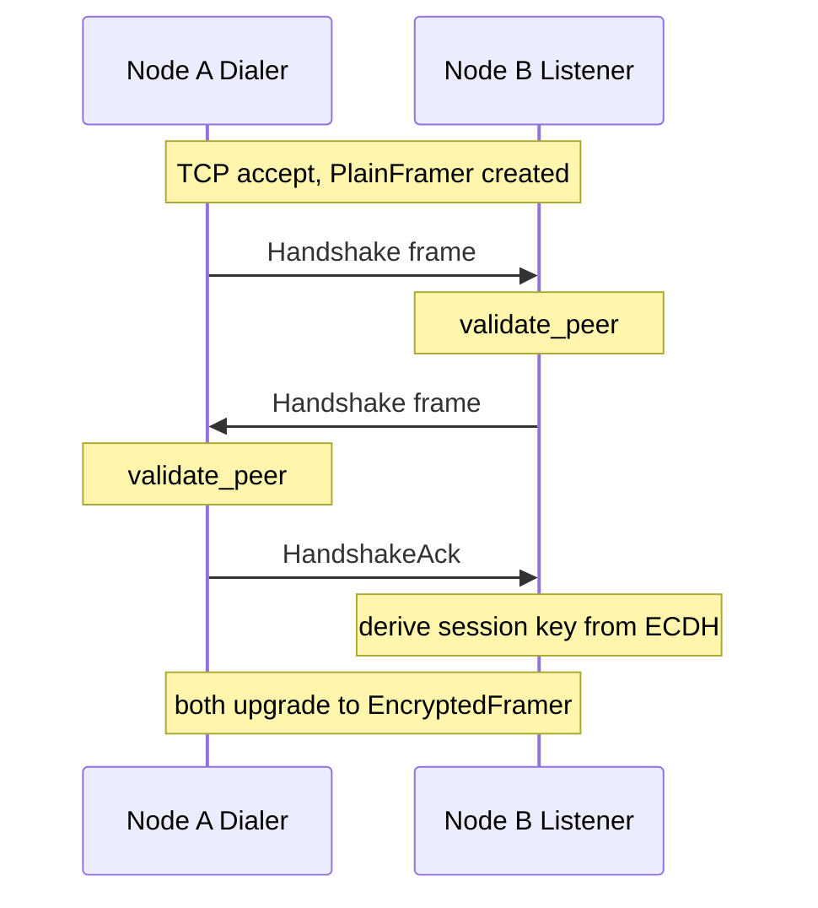
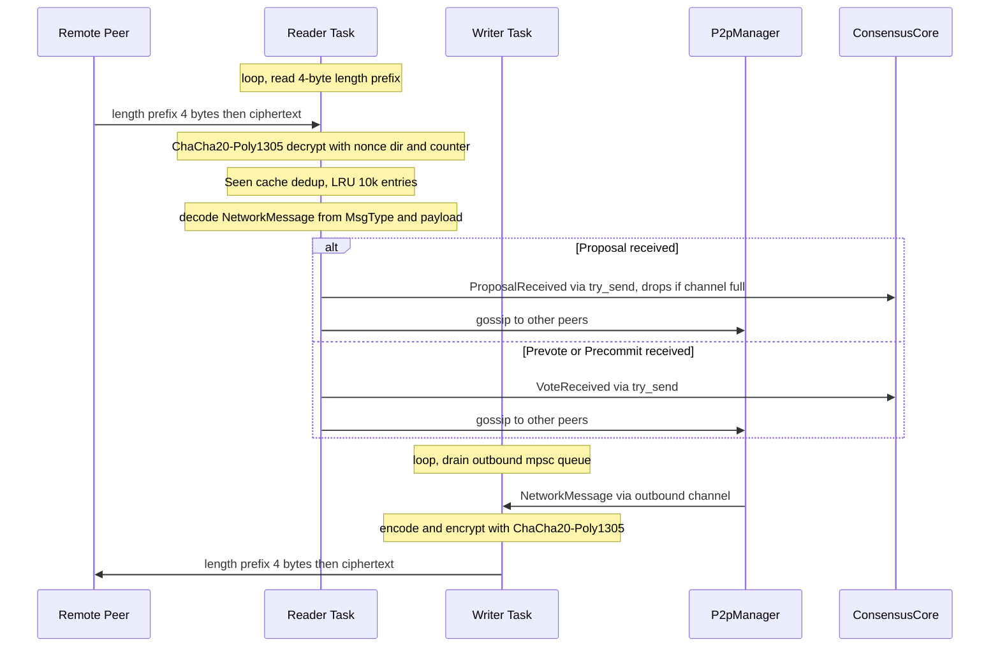

# P2P Handshake Sequence

Source: `src/p2p/peer.rs` — `handshake()`, `src/p2p/manager.rs` — `spawn_peer()`

## Outbound Handshake (node dials seed)

## Inbound Handshake (node accepts connection)

## Post-Handshake Encrypted Message Loop

## Handshake Failure Modes

| Failure | Cause | Result |
|---|---|---|
| Version mismatch | `peer.protocol_version != my_version` | Connection dropped |
| Chain ID mismatch | `peer.chain_id != chain_id.as_bytes()` | Connection dropped |
| Bad ed25519 signature | `VerifyingKey::verify_strict` fails | Connection dropped |
| ACK rejected | Inbound receives ok=false | Connection dropped |
| Oversized frame | `len > max_message_size_bytes` | Reader task exits, PeerDisconnected |
| AEAD decrypt failure | Wrong key or tampered frame | Frame silently dropped, reader continues |

> **Verified against:** `src/p2p/peer.rs` — `handshake()`, `validate_peer()`, `spawn_peer()` writer/reader tasks.
