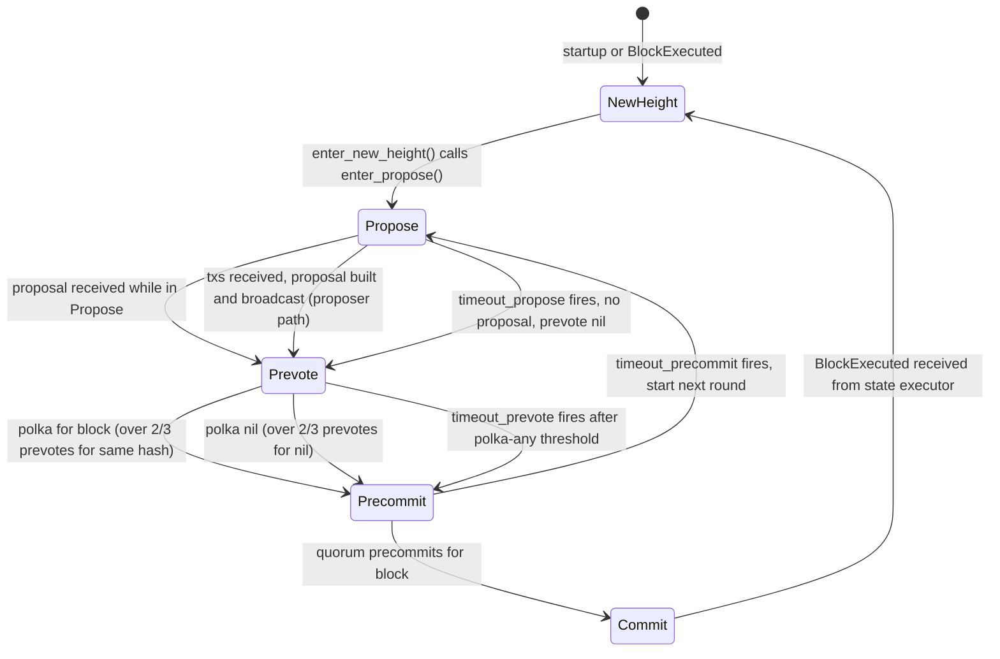
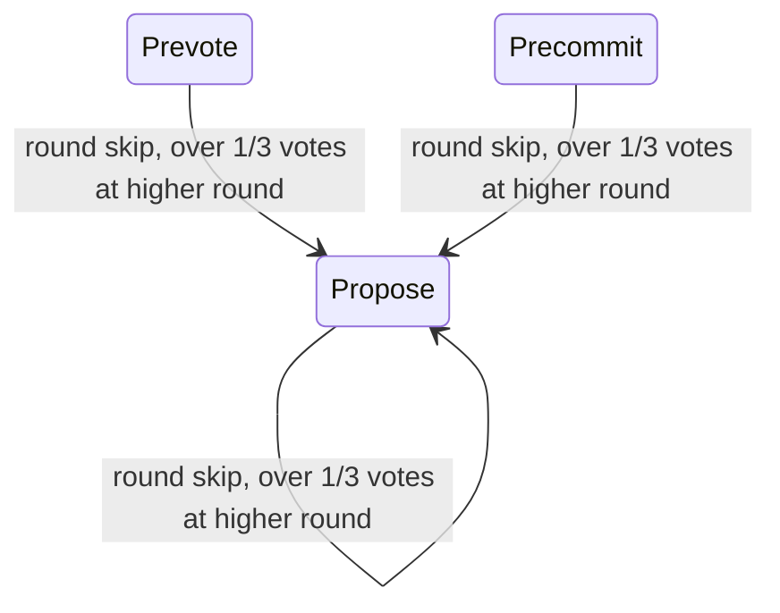

# Consensus Step State Machine

Source: `src/consensus/state.rs` — `enum Step` + `ConsensusCore`

## State Diagram

## Forbidden Transitions

| From | To | Reason |
|---|---|---|
| `Commit` | `Propose` (same height) | Must pass through `NewHeight` to reset locked/valid state |
| `Prevote` | `Propose` (same round) | BFT: once prevoting, cannot re-enter propose for that round |
| `Precommit` | `Prevote` (same round) | One-way progression within a round |
| `NewHeight` | `Commit` | Must pass through Propose, Prevote, Precommit |
| any step | `NewHeight` (mid-round) | Only `handle_block_executed` may call `enter_new_height()` |

## Round Skip

If over 1/3 of voting power is seen at a **higher** round via incoming votes, `check_round_skip()` fires `enter_round(target_round)` from any step except `Commit`. This resets per-round flags but does **not** reset `locked_block` or `valid_block`.

## Notes

- `locked_block` and `valid_block` survive across rounds; only reset on new height.
- `prevoted_this_round` and `precommitted_this_round` prevent double-voting (invariants I1/I2).
- WAL is written before broadcasting a vote or proposal for crash recovery.
- Timeout duration grows linearly: `base_ms + round * delta_ms`.

> **Verified against:** `src/consensus/state.rs` — `enter_propose()`, `enter_prevote()`, `enter_precommit()`, `commit_block_hash()`, `enter_new_height()`, `handle_block_executed()`, `handle_timeout_propose/prevote/precommit()`.
