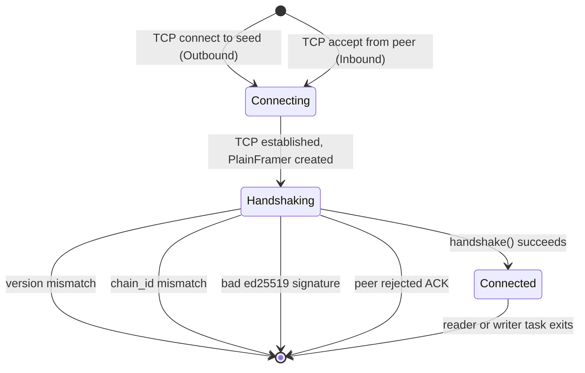

# P2P Peer Connection State Machine

Source: `src/p2p/peer.rs`, `src/p2p/manager.rs`

## State Diagram

## Handshake Steps

**Outbound** (node A dials node B):
1. A sends `Handshake` frame (node_id, ed_pub, protocol_version, chain_id, x_pub, nonce, sig)
2. B validates, sends its own `Handshake` frame
3. A validates, sends `HandshakeAck`
4. Both derive session key: X25519 ECDH then SHA-256 KDF over shared secret + chain_id
5. PlainFramer upgraded to EncryptedFramer (ChaCha20-Poly1305)

**Inbound** (node B accepts from node A):
1. B receives `Handshake`, validates
2. B sends its own `Handshake`
3. B receives `HandshakeAck`
4. Same key derivation, same upgrade

## Connected State

Once `Connected`, two Tokio tasks run per peer:

| Task | Responsibility |
|---|---|
| Writer | Drains outbound `mpsc` queue, encrypts with ChaCha20-Poly1305, writes length-framed TCP |
| Reader | Reads frames, decrypts, deduplicates via LRU `Seen` cache, verifies signatures, forwards `ProposalReceived` / `VoteReceived` to consensus |

## Forbidden Transitions

| From | To | Reason |
|---|---|---|
| `Connected` | `Handshaking` | Session key is fixed per connection; re-key requires a full reconnect |
| `[*]` | `Connected` | Auth handshake is mandatory |
| `Connected` | `Connecting` | MVP has no reconnect loop; disconnected peers are permanently removed |

## MVP Gap

No reconnect loop: when `Connected --> [*]` fires, `Control::PeerDisconnected` removes the peer from `P2pManager.peers` and it is never re-dialed. Seeds are attempted once at startup.

> **Verified against:** `src/p2p/peer.rs` — `handshake()`, `validate_peer()`, `spawn_peer()`; `src/p2p/manager.rs` — `Control` enum, accept loop, seed connect loop.
