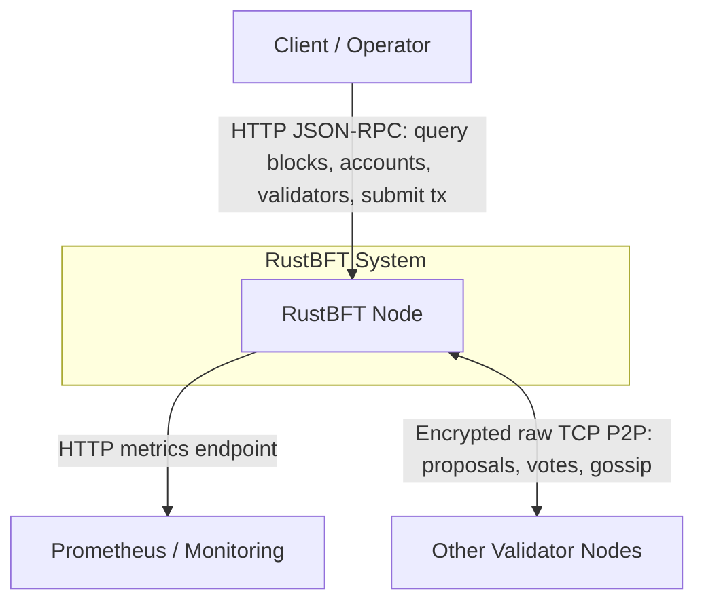
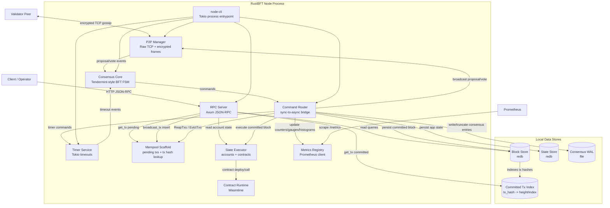
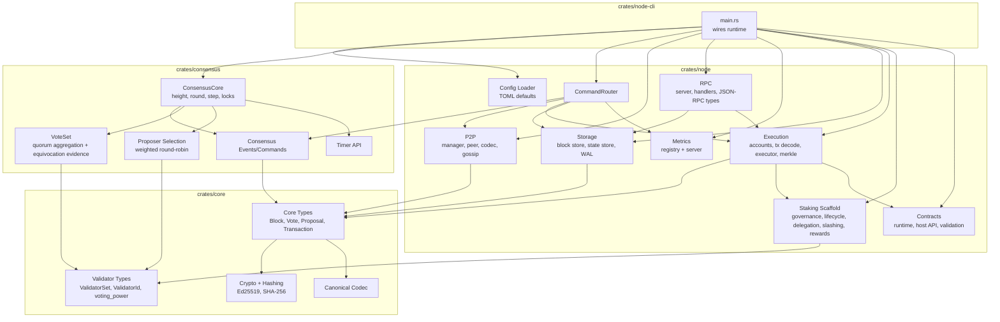
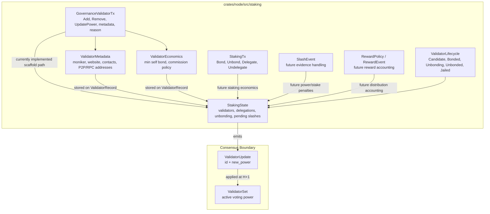
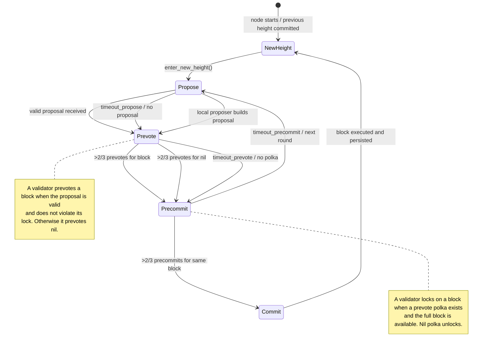
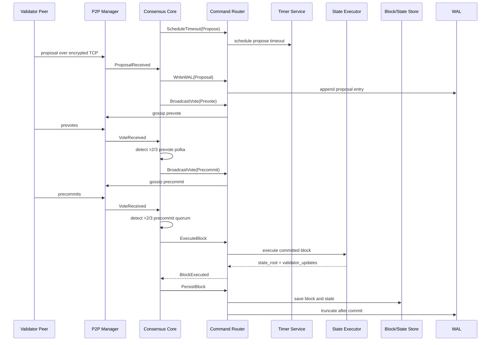
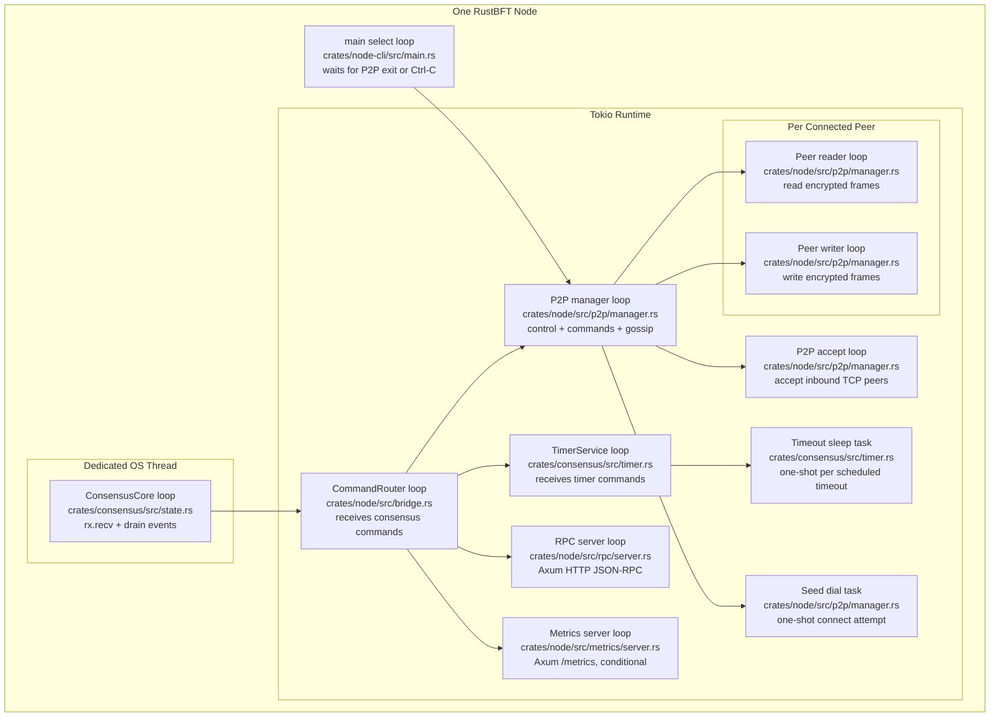
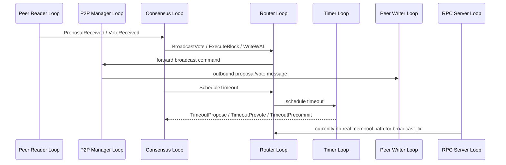

# RustBFT C4 Architecture

This document shows RustBFT using C4-style Mermaid diagrams.

## Level 1: System Context



## Level 2: Container View



## Level 3: Component View



## Staking Scaffold View



## Consensus State Transitions



## Block Commit Sequence



## Runtime Loops Per Node

Application-level persistent loops in one running node:

```text
Base loops:
  1. main shutdown/select wait
  2. consensus core event loop
  3. command router loop
  4. timer service command loop
  5. P2P manager select loop
  6. P2P accept loop
  7. RPC HTTP server loop

Conditional loop:
  8. metrics HTTP server loop, only when metrics_enabled = true

Per connected peer:
  +1 peer reader loop
  +1 peer writer loop

One-shot tasks, not persistent loops:
  seed dial tasks
  individual timeout sleep tasks
```

With metrics enabled, the steady-state loop count is:

```text
7 base loops + 1 metrics loop + (2 * connected_peers)
```



## Loop Interaction Flow



## Current Architecture Notes

```text
Consensus algorithm:
  Tendermint-style BFT: Propose -> Prevote -> Precommit -> Commit

Validator networking:
  Custom raw TCP P2P with encrypted frames, not gRPC

Client API:
  HTTP JSON-RPC

Persistence:
  redb block store, redb state store, file-backed consensus WAL

Execution:
  Account state executor with Wasmtime-based contract runtime

Staking scaffold:
  crates/node/src/staking defines validator lifecycle, staking txs, delegation records,
  governance updates, slashing events, and reward events.
  The only minimal behavior currently implemented is GovernanceValidatorTx -> ValidatorUpdate.
  Rich validator metadata/economics stay in StakingState; consensus still consumes only id + power.

Important current MVP gaps:
  Mempool is in-memory only; tx gossip, persistence, recheck, and retry helpers are future work.
  Proposal/vote signature verification is placeholder-wired in node-cli.
  WAL is written but not replayed on startup yet.
  Genesis validator configuration is not fully wired; node currently bootstraps self.
```
