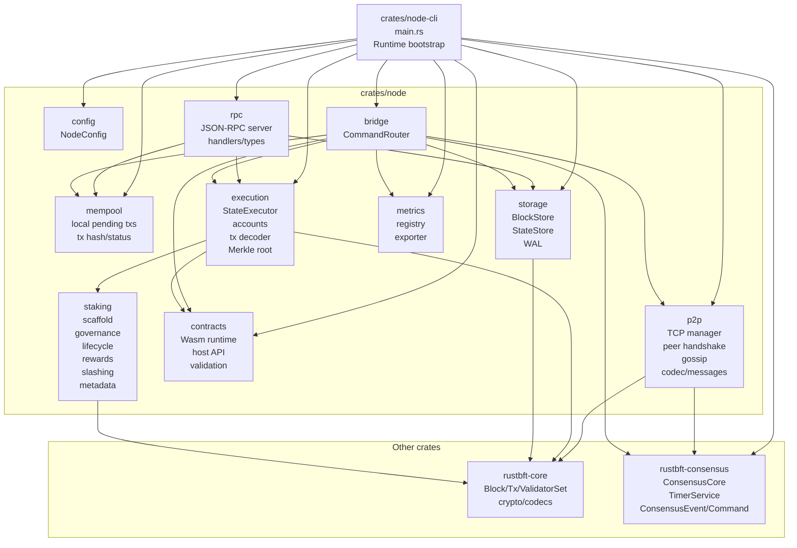
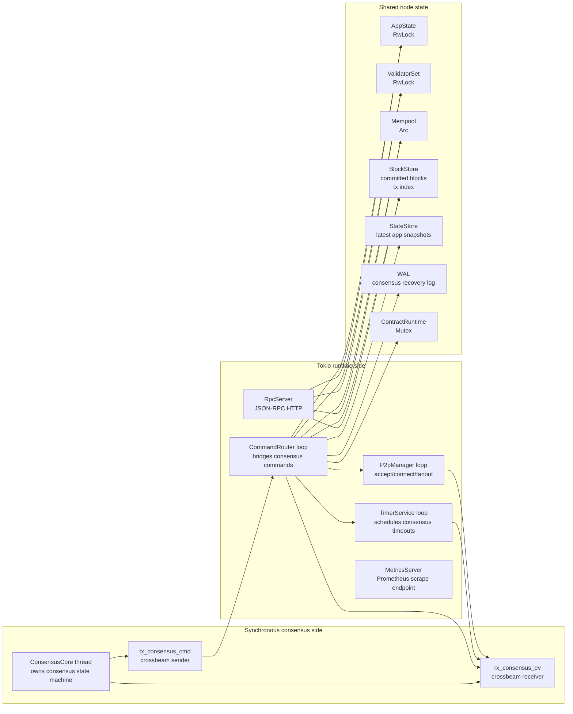
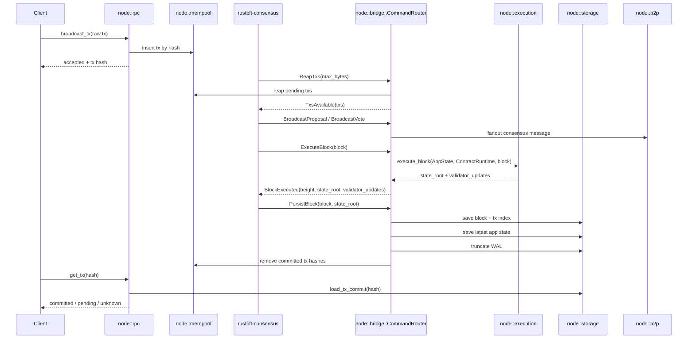
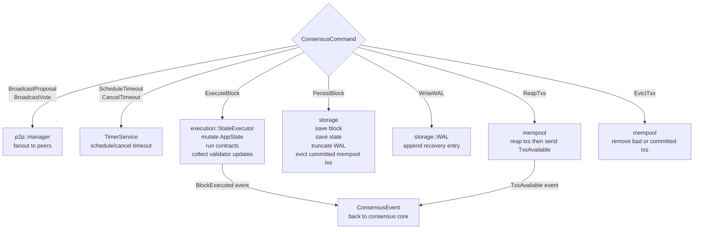
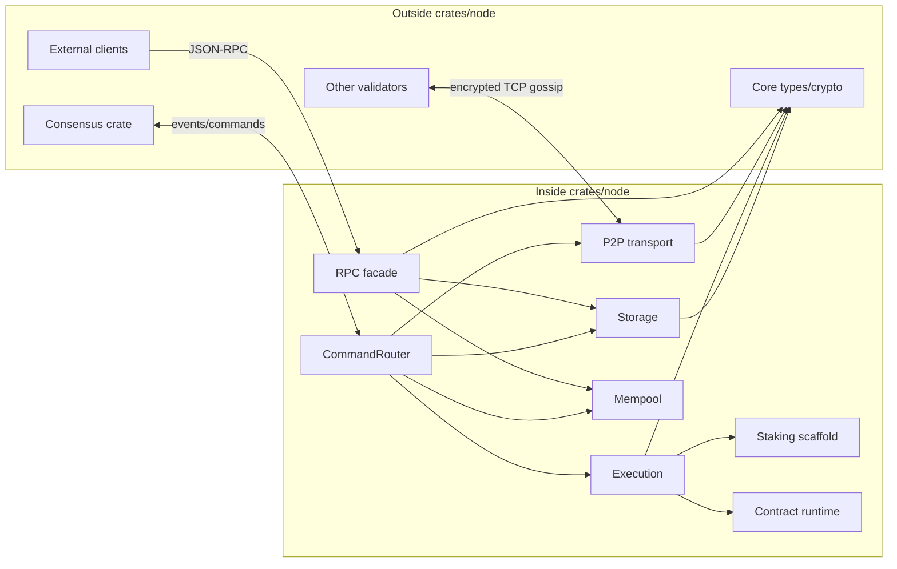

# Node Crate Architecture

This file focuses on `crates/node`, which is the runtime integration crate for storage, execution, networking, RPC, mempool, metrics, contracts, and validator/staking state.

## Module Map

## Runtime Ownership

## Transaction To Commit Flow

## Consensus Command Routing

## Node Crate Boundary

## Reading Notes

- `node-cli` owns process bootstrap and creates the shared runtime objects.
- `crates/node` is not only networking; it is the node integration layer.
- `CommandRouter` is the main internal hub because consensus cannot directly import storage, execution, contracts, or P2P.
- The current network protocol is custom TCP framing with typed consensus messages, not gRPC.
- The current staking module is scaffold-level and only partially participates through validator update transactions.
